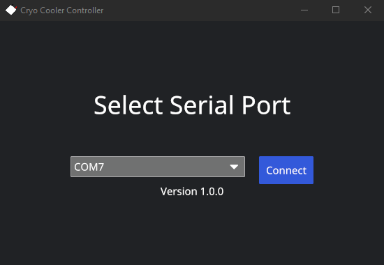
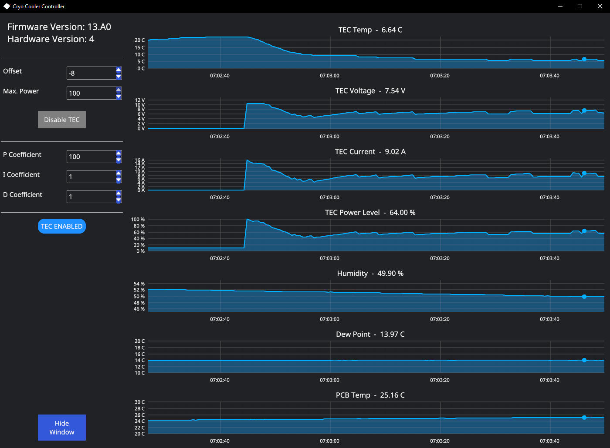

# Cryo Cooler Controller

Cryo Cooler Controller is a tool to control CPU coolers based on Intels Cryo Cooling Technology.

Unlike the official software the supported processors are not artificially restricted. It also offers extra configuration options such as a custom target temperature and manual PID values.

## Supported Coolers

- [MasterLiquid ML360 SUB-ZERO](https://www.coolermaster.com/de/de-de/catalog/coolers/cpu-liquid-coolers/masterliquid-ml360-sub-zero/)
- [EK-QuantumX Delta TEC EVO](https://www.ekwb.com/shop/ek-quantumx-delta-tec-evo-e2-copper-nickel)
- [EK-Quantum Delta² TEC D-RGB](https://www.ekwb.com/shop/ek-quantum-delta2-tec-d-rgb-full-nickel)

## Driver

The required driver should be included with most recent operating systems. For older operating systems you can download them [here](https://www.silabs.com/developers/usb-to-uart-bridge-vcp-drivers?tab=downloads).

## Usage

On the home screen select the port with which the cooler is connected and then click on Connect.
If you are unsure which one that is replug the cooler and watch which one disappears.

Enter the desired offset and click on the Enable TEC button to start the cooler. Note that the offset is relativ to the dew point.
If you do not care about the monitoring you can click on Hide Window.

The software will keep running in the background and keep the cooler active.
You can bring it back by right clicking on the tray icon.

## Know Issues

- Limiting the Maximum TEC power does not work.
- OCP Active warning is sometimes displayed despite the cooler working as expected.

## Additional Information

- https://www.intel.com/content/www/us/en/support/articles/000057816/processors/processor-utilities-and-programs.html
- https://www.intel.com/content/www/us/en/download/715177/intel-cryo-cooling-technology-gen-2.html
- https://codeinsecurity.wordpress.com/2021/09/18/tweaking-the-internals-of-intel-cryo-cooling/
